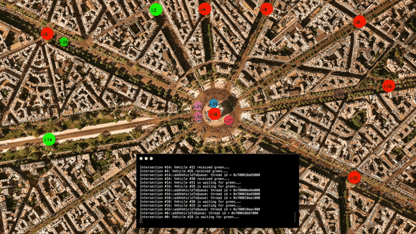
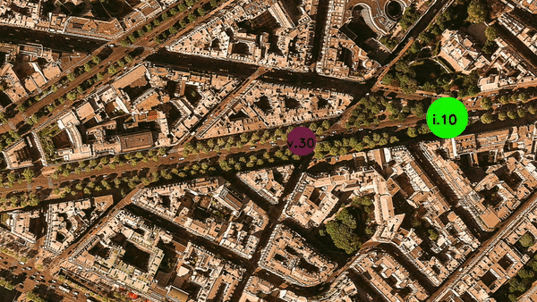

# Udacity C++ Nanodegree

## `Project: Program a Concurrent Traffic Simulation`

The fourth project in the [Udacity C++ Nanodegree Program](https://www.udacity.com/course/c-plus-plus-nanodegree--nd213)

The goal of this course is to learn and apply foundational C++ concepts and practices surrounding concurrency.
Important topics like futures, promises, threads, mutexes, locks, and message queues were learned and applied in this project.

Key Take-Aways

- each Intersection and Vehicle is running within its own thread
- each Traffic Light is running with its own task
- Intersections, Traffic Lights, and Vehicles communicate through concurrent message queues

# Making My Project Stand Out

In order to make my project stand out and from my peers as well as learning to integrate new features to the code base,
`I added the ability for the traffic lights to change from green to yellow.`
Without this new requirement, the vehicles may have entered the intersection immediately before the traffic light changed from green to red -- this gave the visual impression that the vehicle was running a red light but in actual fairness a yellow light should have been displayed.
Now, a vehicle can enter an intersection if the traffic light is green _or_ yellow.
A further improvement to this is to simulate real life conditions such as not entering an intersection if the traffic light is yellow and the vehicle has plenty of distance to arrive to a safe stop before the intersection.

# Room for Improvement

- Message Queue

  The data structure for the Traffic Light message queuing implemented a `std::deque`, but I couldn't seem to limit the size of the deque to just one.
  Since I we really care about is the current Traffic Light color.
  I did not find anything within [std::deque](http://www.cplusplus.com/reference/deque/deque/deque/) where I can limit the size of the queue.
  My implementation is to "pop_back" an element from the queue as soon as the size reaches 2. In Python's standard module [collections](https://docs.python.org/2/library/collections.html#deque-objects), one can set the max length of the deque ... so I was wanting something like that.

- Random Number Generator

  The Traffic Lights needed to cycle between red and green every 4-6 seconds. In order to get a random value in that range I created a new seed and random generator everytime a call to get a random number was made. Is there a way to avoid excessive calls to creating a new seed and generator?
  The reason I created a new seed based on system time was because each traffic light's task was using the exact same seed on creation of the thread, so even though the traffic light duration was random, it was not random with respect to the other traffic lights.

# Dependencies for Running Locally

- cmake >= 2.8
  - All OSes: [click here for installation instructions](https://cmake.org/install/)
- make >= 4.1 (Linux, Mac), 3.81 (Windows)
  - Linux: make is installed by default on most Linux distros
  - Mac: [install Xcode command line tools to get make](https://developer.apple.com/xcode/features/)
  - Windows: [Click here for installation instructions](http://gnuwin32.sourceforge.net/packages/make.htm)
- OpenCV >= 4.1
  - The OpenCV 4.1.0 source code can be found [here](https://github.com/opencv/opencv/tree/4.1.0)
- gcc/g++ >= 5.4
  - Linux: gcc / g++ is installed by default on most Linux distros
  - Mac: same deal as make - [install Xcode command line tools](https://developer.apple.com/xcode/features/)
  - Windows: recommend using [MinGW](http://www.mingw.org/)

# Basic Build Instructions

1. Clone this repo.
2. Make a build directory in the top level directory: `mkdir build && cd build`
3. Compile: `cmake .. && make`
4. Run it: `./traffic_simulation`.
